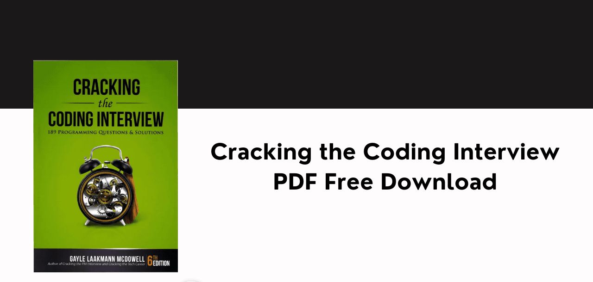

## Data Structures and Algorithm

[You can download the book here for inspiration and technical guidance](/docs/Cracking%20the%20Coding%20Interview%206th%20Edition.pdf)

Data structures and algorithms are essential concepts in computer science and software engineering. They provide a way to store and organize data efficiently, as well as solve complex computational problems. Understanding data structures and algorithms is crucial for developing efficient software applications, writing optimized code, and passing technical interviews. This project will help you learn and implement various data structures and algorithms using Python, Javascript, C and C++. You will explore different types of data structures such as arrays, linked lists, stacks, queues, trees, graphs, and hash tables, and also study fundamental algorithms including sorting, searching, dynamic programming, greedy algorithms, and graph algorithms. By the end of this project, you will have a strong foundation in data structures and algorithms, which will help you solve real-world problems and excel in competitive programming and technical interviews.

### Repository Structure
```txt
data-structures-and-algorithms/
├── README.md
├── src/
│   ├── arrays/
│   │   ├── array_operations.c|.py|.cpp
│   │   └── array_operations_test.c|.py|.cpp
│   ├── linked_lists/
│   │   ├── linked_list.c|.py|.cpp
│   │   └── linked_list_test.c|.py|.cpp
│   ├── stacks_queues/
│   │   ├── stack.c|.py|.cpp
│   │   ├── queue.c|.py|.cpp
│   │   └── stack_queue_test.c|.py|.cpp
│   ├── hash_tables/
│   │   ├── hash_table.c|.py|.cpp
│   │   └── hash_table_test.c|.py|.cpp
│   ├── trees/
│   │   ├── binary_tree.c|.py|.cpp
│   │   ├── binary_search_tree.c|.py|.cpp
│   │   ├── avl_tree.c|.py|.cpp
│   │   ├── heap.c|.py|.cpp
│   │   └── tree_test.c|.py|.cpp
│   ├── graphs/
│   │   ├── graph.c|.py|.cpp
│   │   ├── bfs.c|.py|.cpp
│   │   ├── dfs.c|.py|.cpp
│   │   ├── dijkstra.c|.py|.cpp
│   │   ├── bellman_ford.c|.py|.cpp
│   │   ├── kruskal.c|.py|.cpp
│   │   ├── prim.c|.py|.cpp
│   │   └── graph_test.c|.py|.cpp
│   ├── sorting_searching/
│   │   ├── bubble_sort.c|.py|.cpp
│   │   ├── selection_sort.c|.py|.cpp
│   │   ├── insertion_sort.c|.py|.cpp
│   │   ├── merge_sort.c|.py|.cpp
│   │   ├── quick_sort.c|.py|.cpp
│   │   ├── heap_sort.c|.py|.cpp
│   │   ├── linear_search.c|.py|.cpp
│   │   ├── binary_search.c|.py|.cpp
│   │   └── sorting_searching_test.c|.py|.cpp
│   ├── advanced_algorithms/
│   │   ├── dynamic_programming.c|.py|.cpp
│   │   ├── greedy_algorithms.c|.py|.cpp
│   │   ├── backtracking.c|.py|.cpp
│   │   └── advanced_algorithms_test.c|.py|.cpp
│   └── complexity_analysis/
│       ├── big_o_notation.md
│       ├── time_complexity.md
│       └── space_complexity.md
├── docs/
│   ├── introduction.md
│   ├── data_structures.md
│   ├── algorithms.md
│   └── complexity_analysis.md
├── tests/
│   ├── test_arrays.c|.py|.cpp
│   ├── test_linked_lists.c|.py|.cpp
│   ├── test_stacks_queues.c|.py|.cpp
│   ├── test_hash_tables.c|.py|.cpp
│   ├── test_trees.c|.py|.cpp
│   ├── test_graphs.c|.py|.cpp
│   ├── test_sorting_searching.c|.py|.cpp
│   ├── test_advanced_algorithms.c|.py|.cpp
│   └── test_complexity_analysis.c|.py|.cpp
└── requirements.txt
```
- **README.md**: Project overview and documentation.
- **src/**: Source code for data structures and algorithms.
  - **arrays/**: Implementation and tests for array operations.
  - **linked_lists/**: Implementation and tests for linked lists.
  - **stacks_queues/**: Implementation and tests for stacks and queues.
  - **hash_tables/**: Implementation and tests for hash tables.
  - **trees/**: Implementation and tests for tree data structures.
  - **graphs/**: Implementation and tests for graph data structures and algorithms.
  - **sorting_searching/**: Implementation and tests for sorting and searching algorithms.
  - **advanced_algorithms/**: Implementation and tests for advanced algorithms.
  - **complexity_analysis/**: Documentation on complexity analysis.
- **docs/**: Additional documentation for the project.
- **tests/**: Unit tests for all data structures and algorithms.
- **requirements.txt**: List of dependencies required for the project.

### Objectives
1. **Understand Basic Data Structures**: Learn about arrays, linked lists, stacks, queues, hash tables, trees, graphs, and more.
2. **Implement Data Structures**: Gain hands-on experience by implementing these data structures in C and python.
3. **Explore Algorithms**: Study and implement fundamental algorithms including sorting, searching, dynamic programming, greedy algorithms, and graph algorithms.
4. **Analyze Complexity**: Understand time and space complexity to evaluate the efficiency of algorithms.
5. **Solve Problems**: Apply data structures and algorithms to solve real-world problems and coding challenges.

### Modules
1. **Introduction to Data Structures**
   - Arrays
   - Linked Lists
   - Stacks and Queues
   - Hash Tables

2. **Tree Data Structures**
   - Binary Trees
   - Binary Search Trees
   - AVL Trees
   - Heaps

3. **Graph Data Structures**
   - Graph Representations
   - Graph Traversal Algorithms (BFS, DFS)
   - Shortest Path Algorithms (Dijkstra, Bellman-Ford)
   - Minimum Spanning Tree Algorithms (Kruskal, Prim)

4. **Sorting and Searching Algorithms**
   - Bubble Sort, Selection Sort, Insertion Sort
   - Merge Sort, Quick Sort, Heap Sort
   - Linear Search, Binary Search

5. **Advanced Algorithms**
   - Dynamic Programming (Knapsack, Longest Common Subsequence)
   - Greedy Algorithms (Huffman Coding, Activity Selection)
   - Backtracking (N-Queens, Sudoku Solver)

6. **Complexity Analysis**
   - Big O Notation
   - Time Complexity
   - Space Complexity

### Tools and Technologies

- **Programming Languages**: Python, Javascript, C and C++.
- **Development Environment**: Visual Studio Code, Code::Blocks, or any other IDE.
- **Version Control**: Git and GitHub for source code management.

### Expected Outcomes

By the end of this project, you should be able to:

- Implement and use various data structures and algorithms.
- Analyze the efficiency of different algorithms.
- Solve complex problems using appropriate data structures and algorithms.
- Develop a strong foundation for competitive programming and technical interviews.

### Resources
- **Books**:
  - ["Introduction to Algorithms" by Cormen, Leiserson, Rivest, and Stein](https://mitpress.mit.edu/9780262046305/introduction-to-algorithms/)
  - ["Data Structures and Algorithm Analysis" by Mark Allen Weiss](https://www.pearson.com/store/p/data-structures-and-algorithm-analysis-in-c-/P100000161453)
    - ["Cracking the coding interview" by GAYLE LAAKMANN](https://drive.google.com/file/d/1HlKvNPzeixl8TAgkGYLGxM8WdH_Y7UMr/view?usp=sharing)

- **Online Courses**:
  - [Coursera](https://www.coursera.org/)
  - [edX](https://www.edx.org/)
  - [Udacity](https://www.udacity.com/)

- **Coding Practice**:
  - [LeetCode](https://www.leetcode.com)
  - [HackerRank](https://www.hackerrank.com)
  - [CodeSignal](https://www.codesignal.com)
  - [Codewars](https://www.codewars.com)
